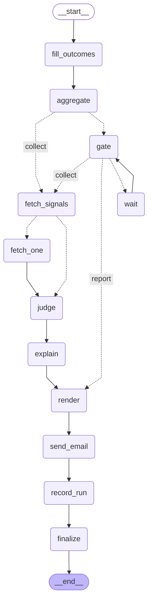

# GRAPH.md — 컴파일된 그래프

> **이 파일은 손으로 고치지 않는다.** `python scripts/export_graph.py`가 만든다.
> 그래프를 고쳤으면 다시 돌린다 — 안 그러면 문서가 거짓말을 한다 (SPEC N16).
> 손그림 `docs/diagrams/graph.dot`과의 대조는 `python scripts/check_diagram.py`가 한다.

## 읽는 법

- `fill_outcomes → aggregate`가 **게이트보다 앞**에 있다. 어제 판정 채점은 오늘 신호와 무관해서,
  게이트가 `stale`·`gate_timeout`으로 끝나는 날에도 돌아야 한다.
- `gate → wait → gate`는 **사이클**이다. 1분씩 10회 기다렸다 포기한다 (F1).
- `fetch_signals`에서 갈라지는 두 갈래가 fan-out이다. 신호 0건이면 `judge`로 직행한다.
- `judge`가 `explain`보다 **앞**이다. LLM이 죽어도 판정은 이미 저장돼 있다 (F20).

## 간선 목록 (17개)

| from | to | 조건 |
|---|---|---|
| `__start__` | `fill_outcomes` | — |
| `aggregate` | `fetch_signals` | collect |
| `aggregate` | `gate` | — |
| `explain` | `render` | — |
| `fetch_one` | `judge` | — |
| `fetch_signals` | `fetch_one` | — |
| `fetch_signals` | `judge` | — |
| `fill_outcomes` | `aggregate` | — |
| `finalize` | `__end__` | — |
| `gate` | `fetch_signals` | collect |
| `gate` | `render` | report |
| `gate` | `wait` | — |
| `judge` | `explain` | — |
| `record_run` | `finalize` | — |
| `render` | `send_email` | — |
| `send_email` | `record_run` | — |
| `wait` | `gate` | — |
