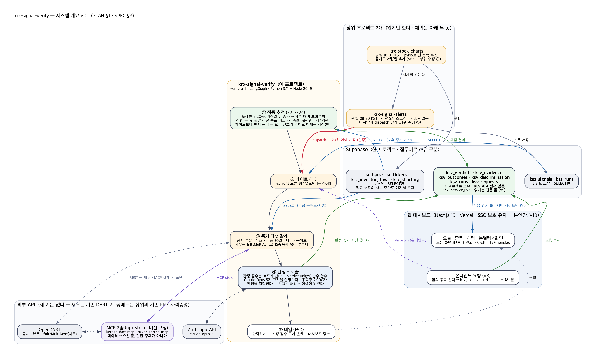
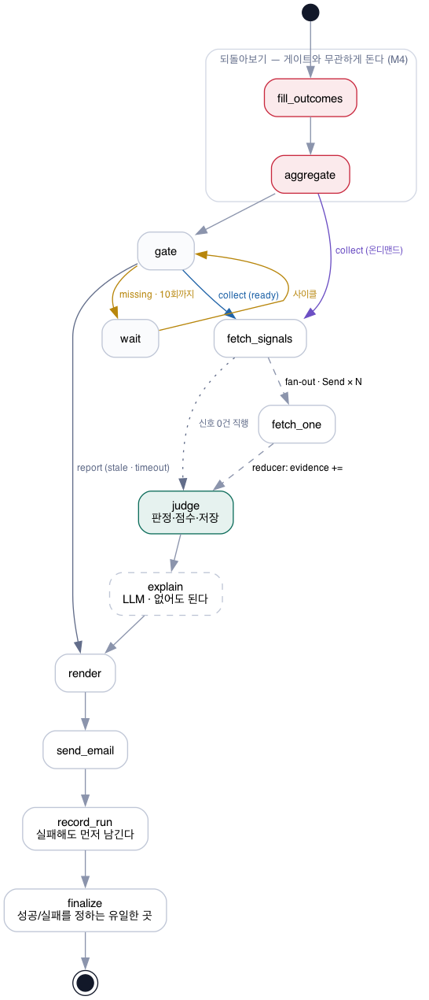
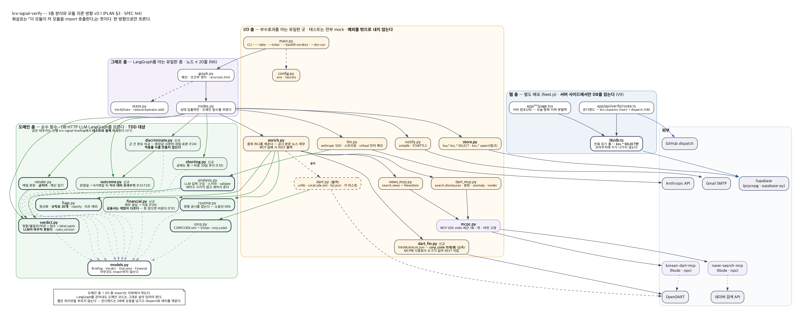
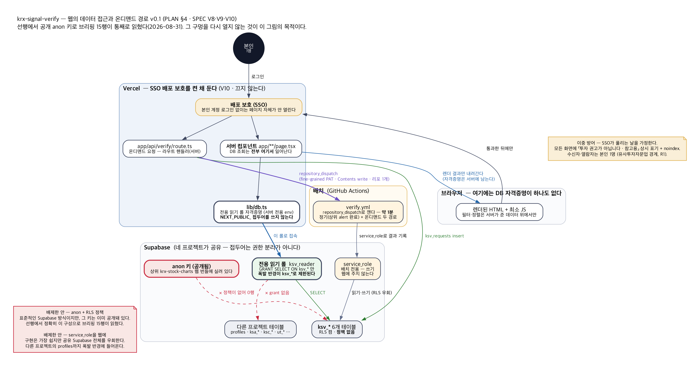
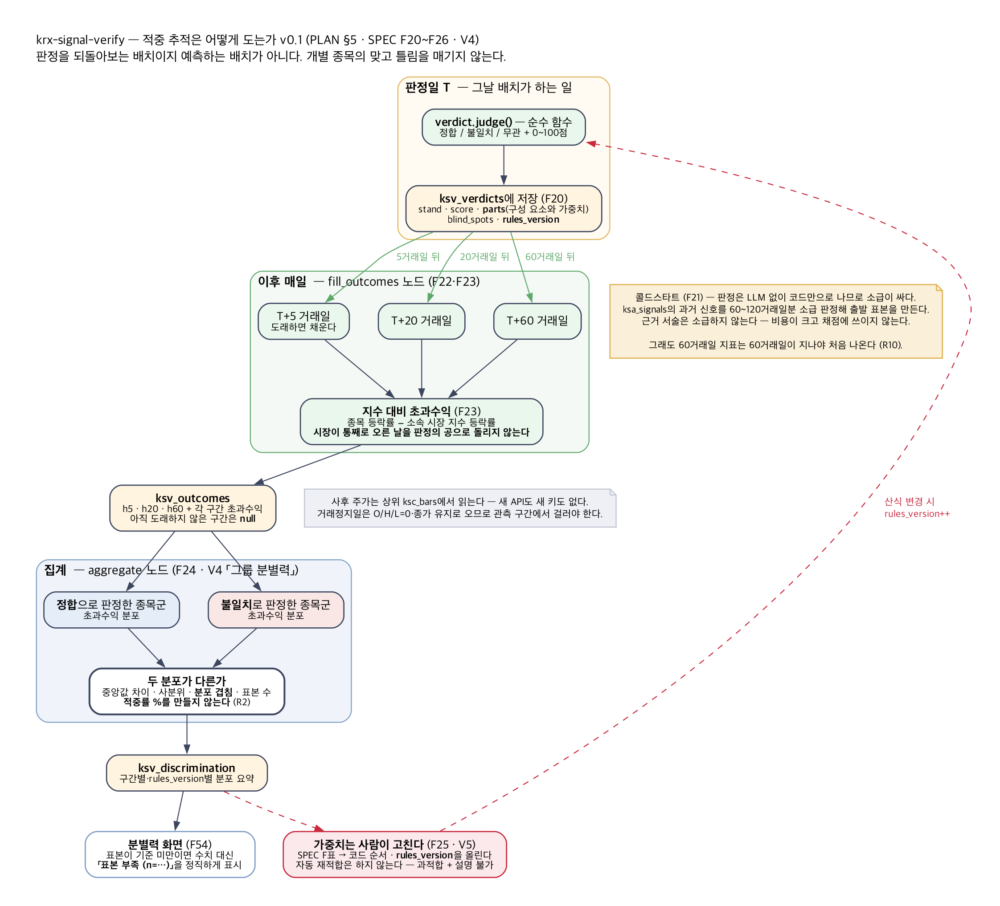

# PLAN.md — krx-signal-verify

> **v0.1** (2026-08-31). 기준: `SPEC.md` **v0.2** — 결정 V1~V11이 **전부 확정**됐다.
> 이 문서는 SPEC의 "무엇을"을 "어떻게·어떤 순서로"로 옮긴 것이다. 요구사항이 바뀌면 SPEC을 먼저 고친다.
>
> **그림은 `docs/diagrams/*.dot`가 원본이고 PNG는 Graphviz 산출물이다.** 고치면 반드시 다시 렌더링한다 —
> 선행 프로젝트에서 설계도 3장이 전부 두 판 낡은 채 남아 있었다(2026-08-31). 방지책은 §7에 있다.

---

## 1. 아키텍처



읽는 방향은 셋이다.

| 방향 | 내용 |
|---|---|
| **위 → 아래** | 상위 두 프로젝트가 Supabase를 채우고, 이 프로젝트가 그것을 읽어 판정하고, 결과를 `ksv_*`에 쓴다 |
| **왼쪽 아래** | 외부 API — MCP 2종과 OpenDART, Anthropic. **새 키가 하나도 없다** |
| **오른쪽 아래** | 웹 대시보드 — `ksv_*`를 **전용 읽기 롤로 서버 사이드에서만** 읽는다 |

### 1-1. 상위 프로젝트를 고치는 곳은 두 군데뿐

이 프로젝트는 상위의 읽기 전용 소비자다. 예외가 정확히 둘이다.

| # | 리포 | 변경 | 근거 |
|---|---|---|---|
| ①a | `krx-stock-charts` | 일일 갱신에 **지수 수집 2회**(KOSPI `1001`·KOSDAQ `2001`)를 더하고 **`ksc_index_bars`**에 적재 + 3년 백필 | **V12 A안.** `get_index_ohlcv`가 **3년 726행을 1회 호출**로 준다(2026-09-01 실측) — 백필도 시장당 1회다. **없어도 되는 층이 아니다** — 이게 없으면 M4가 통째로 서지 않는다 |
| ①b | `krx-stock-charts` | 일일 갱신에 **공매도 수집 2회**를 더하고 `ksc_shorting`에 적재 | V6b. `get_shorting_volume_by_ticker`가 시장당 1회로 전 종목을 준다(KOSPI 944행 실측). 수급(선행 D22)과 같은 패턴이라 상위 코드에 이미 자리가 있다. **없어도 되는 층이다** |
| ② | `krx-signal-alerts` | 마지막에 **`repository_dispatch`** 단계 (이 리포를 깨운다) | 선행에서 이미 넣어 둔 것을 **대상 리포만 바꾼다**. 선행 것은 병행 기간 동안 함께 돈다 (V1) |

> **①a·①b 모두 사용자 승인이 필요하다.** 상위 리포를 고치는 일이고, 그 리포는 08-18~08-31에 조용히 2주간 멈춘 전력이 있다.
> **다만 둘의 무게가 다르다.**
>
> | | 승인이 늦어지면 |
> |---|---|
> | **①a 지수** | **M4(적중 추적)를 시작할 수 없다.** F22~F24·F54가 전부 기준선 위에 서 있다 — 없는 층으로 둘 수 없다 |
> | ①b 공매도 | 그 갈래만 비우고 나머지로 진행한다 (F34) |
>
> 그래서 **①a를 M4보다 먼저** 세운다 (§8). 프록시로 대신 재는 길은 V12에서 **버렸다** —
> 기준선의 출처가 나머지 데이터와 어긋나기 때문이다.

### 1-2. LangGraph 그래프



선행 그래프에서 **세 가지가 달라졌다.**

| 변화 | 이유 |
|---|---|
| **`route_mode` 진입 분기** — 배치 / 온디맨드 | V8. 온디맨드는 게이트도 메일도 필요 없고 종목이 하나다. 같은 fan-out·판정 경로를 재사용한다 |
| **`fill_outcomes` → `aggregate`가 게이트보다 먼저** | 어제 판정 채점은 오늘 신호와 무관하다. 게이트가 `stale`이나 `gate_timeout`으로 끝나는 날도 **채점은 돌아야 한다** |
| **`summarize`가 `judge` + `explain` 둘로 갈라짐** | 선행에서는 한 노드가 판정 계산과 LLM 호출을 겸했다. 이제 판정은 **저장까지 하는 별도 단계**이고(F20), LLM은 그 뒤에 붙는 선택 층이다. **LLM이 죽어도 판정은 이미 저장돼 있다** |

노드는 **20줄을 넘지 않는다**. 넘으면 도메인 로직이 샌 것이니 도메인 모듈로 옮긴다.
**I/O 노드는 예외를 밖으로 내지 않는다** — 여기서 예외가 새면 `record_run`에 못 가 그날 실패 기록까지 사라진다.
실패 판정은 `finalize` 한 곳이다.

### 1-3. 상태 정의 (`state.py`)

```python
class VerifyState(TypedDict, total=False):
    # 입력
    mode: str                 # "batch" | "ondemand"
    run_date: date            # KST 기준일
    ticker: str               # 온디맨드일 때만
    force: bool
    dry_run: bool

    # 게이트
    gate: str                 # ready | stale | missing | timeout
    attempts: int
    data_date: date | None

    # 수집
    signals: list[SignalRow]
    corps: dict[str, str]
    flows: dict[str, Flow]         # 시총·거래대금
    investor: dict[str, list]      # 기관·외국인 30일
    shorting: dict[str, list]      # 공매도 20일 (없을 수 있다)

    # fan-out 합류 — reducer가 없으면 마지막 하나만 남는다
    evidence: Annotated[list[Evidence], operator.add]

    # 판정·서술
    verdicts: dict[str, Verdict]
    summaries: dict[str, str]
    summary_error: str

    # 적중 추적
    outcomes_filled: int
    discrimination: dict[str, Any]

    # 출력
    subject: str
    text: str
    html: str
    send: SendResult
    status: str
```

> **`evidence`에 `Annotated[list, operator.add]`를 빼먹으면 fan-out 결과가 마지막 하나만 남고 예외도 안 난다.**
> 상위 프로젝트에서 실증된 함정이다. `tests/test_graph.py`의 합류 테스트가 유일한 방어선이니 지우지 않는다.

---

## 2. 디렉토리 구조

```
krx-signal-verify/
├── verify/                    # 배치
│   ├── state.py  nodes.py  graph.py        ← 그래프 층 (LangGraph를 아는 유일한 층)
│   ├── models.py                            ← 아무것도 import하지 않는다
│   ├── corp.py  flags.py  routine.py        ← 도메인 · 선행에서 이식 (V11)
│   ├── verdict.py  render.py  analysis.py   ← 도메인 · 선행에서 이식 (V11)
│   ├── financial.py  shorting.py            ← 도메인 · 신규
│   ├── outcome.py  discriminate.py          ← 도메인 · 신규 (적중 추적)
│   ├── store.py  enrich.py  mcpc.py         ← I/O
│   ├── dart.py  dart_mcp.py  dart_fin.py  news_mcp.py
│   ├── llm.py  notify.py  config.py  main.py
├── web/                       # Next.js 16 대시보드
│   ├── app/(dash)/page.tsx           오늘
│   ├── app/(dash)/s/[ticker]/page.tsx 종목
│   ├── app/(dash)/history/page.tsx    이력
│   ├── app/(dash)/discrimination/page.tsx 분별력
│   ├── app/api/verify/route.ts       온디맨드 요청 → dispatch
│   └── lib/db.ts                     전용 읽기 롤 (서버 전용)
├── supabase/schema.sql        # ksv_* 6개 · RLS 켜고 정책 없음 · 읽기 롤 grant
├── scripts/
│   ├── apply_schema.py
│   ├── backfill_verdicts.py   # 과거 신호 소급 판정 (F21 콜드스타트)
│   ├── export_graph.py        # 그래프 → docs/GRAPH.md
│   └── check_diagram.py       # graph.dot ↔ GRAPH.md 간선 대조 (§7)
├── tests/                     # 도메인 함수를 직접 부른다. 외부 I/O는 전부 mock
├── docs/  diagrams/  *.png  SPEC.md  PLAN.md  DESIGN.md  TASKS.md  GRAPH.md
└── .github/workflows/verify.yml  ci.yml
```

---

## 3. 모듈 의존 관계 — 함수 호출은 한 방향으로만 흐른다



굵은 테두리가 **선행 `krx-signal-briefing`에서 테스트와 함께 이식**하는 모듈이다 (V11).
실측으로 값을 치른 것들이라 다시 만들지 않는다.

| 이식 | 무엇을 치렀나 |
|---|---|
| `flags.py` — 규칙표 20개 | 실표본 3,000건으로 세우고 DART 원문 손검증 **11/12** |
| `routine.py` | 정형 공시가 소음의 **65%**임을 실측하고 만든 것 |
| `verdict.py` | 가중치·`blind_spots` 설계. **점수 산식이 곧 SPEC** |
| `render.py` 금지어 | `순매도`가 `매도`에 걸려 분석 15개가 통째로 버려진 사고를 겪고 만든 `ALLOWED_COMPOUNDS` |
| `corp.py` | `0126Z0` 같은 문자 티커, `stock_code` 문자열 비교 |
| `analysis.py` | 「세라고 시키지 말고 세어서 준다」 — 건수 날조를 겪고 만든 `validate` |

### 3-1. 신규 도메인 모듈 넷

| 모듈 | 하는 일 | 조심할 것 |
|---|---|---|
| `financial.py` | `fnlttMultiAcnt` 응답 → 지표 (F30) | **금융사는 계정이 다르다** — `순이자손익`·`예수부채`·`차입부채`가 온다(실측). `매출액`·`영업이익`을 못 찾으면 **비우고 그렇다고 적는다.** 억지 매핑 금지 (F31) |
| `shorting.py` | 공매도 행 → 비중 20일 추이 (F32) | 상위가 안 채웠으면 **없는 층**으로 흐른다 |
| `outcome.py` | 판정일 → N거래일 뒤 **지수 대비 초과수익** (F22·F23) | **거래정지일**은 O/H/L=0·종가 유지로 온다 — 관측 구간에서 걸러야 한다 (상위에서 VCP 판정이 545→176건으로 정상화된 사고) |
| `discriminate.py` | 군 간 분포 비교 (F24) | **적중률 %를 만들지 않는다.** 반환 타입에 그런 필드를 두지 않아 구조적으로 막는다 |

### 3-2. 신규 I/O 모듈 하나

`dart_fin.py` — `fnlttMultiAcnt.json`을 **REST로 직접** 부른다. MCP에 다중회사 도구가 없다.
**corp_code 15개를 한 번에** 받는 것을 실측했다(2026-08-31: 15/15 회사 · 442항목 · `status 000`).
44종목이면 3회다. DART 키가 URL 쿼리에 실리므로 **예외 메시지에서 URL을 마스킹한다**.

---

## 4. 웹의 데이터 접근 — 여기가 이 프로젝트의 보안 급소다



선행에서 `ksb_*`에 `to anon` 정책을 열어 뒀다가, **공개된 anon 키로 브리핑 15행이 통째로 읽혔다**
(2026-08-31 실증: 티커·종목명·공시 목록·등급·판정·근거 서술). 그 anon 키는 상위 `krx-stock-charts`
웹 번들에 실려 있다. 대시보드를 만들면 이 문제가 그대로 돌아온다.

### 4-1. 세 겹으로 막는다

| 겹 | 내용 |
|---|---|
| ① **Vercel SSO 배포 보호** | 본인 계정 로그인 없이는 페이지 자체가 안 열린다. **끄지 않는다** (V10) |
| ② **전용 읽기 롤** | `ksv_reader`에 `GRANT SELECT ON ksv_*`만. 폭발 반경이 `ksv_*`로 제한된다 (V9). **`GRANT`만으로는 부족하다** — RLS가 켜져 있으므로 `to ksv_reader` SELECT 정책을 함께 만든다 (SPEC §5). 정책이 없으면 이 롤도 0행을 받는다 |
| ③ **서버 사이드 전용** | 자격증명은 서버 컴포넌트/라우트 핸들러에만. **`NEXT_PUBLIC_` 접두어를 쓰지 않는다** — 브라우저에 키가 나가지 않는다 |

### 4-1b. 커넥션은 풀러를 거친다

V9는 PostgREST가 아니라 **Postgres 롤 직결**이다. Vercel 서버리스는 요청마다 함수 인스턴스가 살아나므로,
각자 커넥션을 열면 Supabase 기본 풀이 금방 마른다 — 그리고 그때 나는 오류는 「DB가 죽었다」처럼 보인다.

| | |
|---|---|
| 접속 | **커넥션 풀러(포트 `6543`) · transaction 모드.** 직결 포트 `5432`를 쓰지 않는다 |
| 드라이버 | `pg` Pool을 **모듈 스코프에 하나** 두고 재사용한다. 핸들러 안에서 `new Pool()`을 만들지 않는다 |
| 상한 | `max`를 작게(2~3) 잡는다. 인스턴스가 여럿이므로 합이 커진다 |
| 주의 | transaction 모드는 **prepared statement를 지원하지 않는다** — 드라이버 설정에서 꺼야 한다 |

배제한 안과 이유는 SPEC §2-3 V9에 남겨 두었다. 요약하면 **anon+RLS는 오늘 닫은 구멍을 다시 여는 것**이고,
**service_role은 공유 Supabase 전체를 우회**해 다른 프로젝트의 `profiles`까지 폭발 반경에 들어온다.

### 4-2. 온디맨드 요청 경로 (V8)

```
브라우저 → (SSO) → /api/verify 라우트 핸들러
                      ├─ ksv_requests INSERT
                      └─ GitHub repository_dispatch  ──→ verify.yml 이 그 요청만 처리
                                                            └─ 결과를 ksv_verdicts 에 쓴다
                      ← 약 1분 뒤 종목 화면에 결과
```

선행에서 실증한 경로다 — HTTP 204 → **20초 안에 워크플로 시작**.
대가는 웹에 **리포 쓰기 토큰**이 하나 생기는 것이다 (fine-grained PAT · 대상 리포 1개 · Contents write).
요청 상한(하루 N건, 동시 1건)을 두어 LLM 비용이 새지 않게 한다 (F42).

---

## 5. 적중 추적 — 이 프로젝트를 새로 만드는 이유



선행은 판정을 **렌더 때 계산하고 버렸다** — 그래서 이력이 없다(2026-08-31 확인: `ksb_briefings`에 `stand`·`score` 열이 없다).
여기서는 판정을 저장하고, 도래한 구간의 주가를 붙여, **판정에 분별력이 있었는지**를 잰다.

### 5-1. 「맞았다」의 정의가 곧 경계다 (V4)

`불일치`는 **"근거가 신호와 어긋난다"**이지 **"떨어진다"**가 아니다.
개별 적중률로 채점하는 순간 이 프로젝트는 하지 않기로 한 일(예측)을 하는 장치가 된다.

```
하지 않는 것          「이 종목은 불일치였고 실제로 떨어졌다 → 적중」
                       → 화면에 「불일치 적중률 68%」가 뜨면 다음 판정을 예측으로 읽는다

하는 것               「정합으로 판정한 종목군과 불일치로 판정한 종목군의
                        지수 대비 초과수익 분포가 서로 다른가」
                       → 중앙값 차이 · 사분위 · 분포 겹침 · 표본 수
```

이 정의를 **코드 구조로도 강제한다** — `discriminate.py`의 반환 타입에 적중률 필드를 두지 않고,
`render`·웹 양쪽에 `적중률`·`승률`·`수익률` 금지어 테스트를 건다 (N2).

### 5-2. 시간이 걸린다는 것을 정직하게 다룬다

| 구간 | 첫 수치가 나오는 시점 |
|---|---|
| 5거래일 | 첫 주 |
| 20거래일 | 약 1개월 |
| 60거래일 | **약 3개월** |

콜드스타트(F21)로 앞당긴다 — **판정은 LLM 없이 코드만으로 나므로 소급이 싸다.**
`ksa_signals`의 과거 신호를 60~120거래일분 소급 판정해 출발 표본을 만든다 (근거 서술은 소급하지 않는다).
그래도 표본이 기준 미만인 동안 화면은 **「표본 부족 (n=…)」**을 그대로 표시한다 — 없는 확신을 만들지 않는다.

### 5-3. 가중치는 사람이 고친다 (V5)

집계 결과는 **관측치로만** 내놓는다. 가중치 변경은 `SPEC` F표 → 코드 순서를 지키고, 바꿀 때 `rules_version`을 올린다.
과거 판정은 **그때의 산식으로 남는다** — 그러지 않으면 서로 다른 자로 잰 값을 한 표에 섞게 된다.

---

## 6. 데이터 계약

### 6-1. 읽는 계약 — 상위 테이블

| 테이블 | 우리가 의존하는 것 | 깨지면 |
|---|---|---|
| `ksa_runs` | `run_at`(KST 날짜) · `data_date` · `status` | 게이트가 판정을 못 한다 → `gate_timeout` |
| `ksa_signals` | `suppressed` · `evidence`(jsonb) | **`evidence`는 우리가 통제하지 않는다** — `null`, 쉼표 낀 문자열 종가, 목록 아닌 `conditions`가 실제로 왔다. `SignalRow`가 전부 빈 값으로 떨어뜨린다. **직접 `.get()`으로 파헤치지 않는다** |
| `ksc_bars` | 일봉 종가 — 증거의 시세와 **적중 추적의 사후 주가** | 낡으면 채점이 밀린다. `ksc_meta`로 신선도를 보고 **낡았으면 표시한다** |
| `ksc_investor_flows` | 기관·외국인 순매수 (120일 보존) | 관측 창을 20~60일로 설계 |
| `ksc_shorting` | 공매도 거래량·비중 (V6b 승인 후) | 없으면 그 갈래만 생략 |

### 6-2. 쓰는 계약 — `ksv_*` 6개

| 테이블 | 키 | 비고 |
|---|---|---|
| `ksv_verdicts` | `(d, ticker, source)` | `source`가 `batch`/`ondemand`. **집계에서는 섞지 않는다** — 궁금해서 넣은 종목은 표본이 편향돼 있다 (F43) |
| `ksv_evidence` | `(d, ticker)` | 공시·본문·뉴스·수급·재무·공매도 jsonb |
| `ksv_outcomes` | `(d, ticker)` | 미도래 구간은 `null`, 매일 채운다 |
| `ksv_discrimination` | `(as_of, horizon, rules_version)` | 분포 요약 |
| `ksv_runs` | `run_at` | 실패해도 먼저 기록 |
| `ksv_requests` | `id` | 온디맨드 큐 |

> **`ksv_*`의 소비자가 하나 더 생길 수 있다** (SPEC V14, 2026-09-02) — MCP 서버가 이 테이블들을
> **읽기 전용**으로 조회하는 창구가 될 수 있다. 어느 프로젝트에서 만들지는 M3 이후에 정한다.
> 지금 준비할 것은 하나뿐이다: **`store.py`의 조회 함수를 그래프 상태에 묶지 않는다** —
> 순수한 「인자 → 행」 모양이면 그대로 도구가 되고, 아니면 나중에 두 번 짓는다.
> 그리고 **그 서버가 생겨도 이 프로젝트의 배치는 그것을 부르지 않는다** (선행 D14 v2).

**저장은 청크로 나눠 보낸다.** 선행에서 44행을 한 문장으로 upsert했다가 `57014 statement timeout`으로
**하루치가 통째로 사라졌다**(2026-08-31). 그리고 **되살리는 열이 저장하는 열보다 적으면 재실행이 지운다** —
`to_row()`에 열을 늘리면 `fetch_*`도 함께 늘리고, 왕복 테스트로 잠근다.

---

## 7. 문서가 낡지 않게 하는 장치

선행에서 설계도 3장이 전부 두 판 낡은 채 남아 있었다 — `arch.dot`에는 이미 뺀 MCP 서버가, `modules.dot`에는
새로 생긴 모듈 6개가 빠져 있었다. **손그림은 조용히 낡고 아무도 알려 주지 않는다.**

| 장치 | 내용 |
|---|---|
| `scripts/export_graph.py` | 컴파일된 그래프 → `docs/GRAPH.md` (mermaid). 그래프를 고치면 반드시 재실행 |
| **`scripts/check_diagram.py`** | **`graph.dot`의 간선과 `GRAPH.md`의 간선을 대조**한다. 어긋나면 CI 실패 |
| `tests/test_schema.py` | `schema.sql`에 **`to anon` 정책이 부활하면 실패**하고, **`to ksv_reader` 정책이 사라져도 실패**한다 (선행에서 이식 + V9). 「정책 0개」를 검사하면 대시보드가 막힌 것을 못 잡는다 |
| CI | 위 둘을 `ci.yml`에서 돌린다 — 설계도와 코드가 갈라지면 머지 전에 잡힌다 |

---

## 8. 마일스톤

각 마일스톤은 **ruff · mypy strict · pytest** 전부 통과가 완료 전제다.
웹이 있는 마일스톤은 **DESIGN 시안 합의**가 선행 조건이다 (워크스페이스 CLAUDE.md 진행 원칙 3).

| # | 이름 | 범위 | 완료 기준 |
|---|---|---|---|
| **M0** | 뼈대 + 걷는 해골 | 리포·스키마(`ksv_*` 6개 · RLS 정책 없음 · 읽기 롤)·CI·그래프 배선(빈 노드)·게이트 실DB 확인 | `--dry-run`이 게이트→판정 0건→`record_run`까지 완주 · **anon으로 `ksv_*`가 빈 배열** |
| **M1** | 도메인 이식 ★ TDD | `flags`·`routine`·`verdict`·`render`·`corp`·`analysis`를 **테스트와 함께** 옮긴다 (V11) | 이식한 테스트가 전부 초록 · 선행과 같은 입력에 **같은 판정**이 나오는 대조 테스트 |
| **M2** | 증거 다섯 갈래 | `enrich`·`dart_mcp`·`news_mcp`·`dart_fin`·`financial`·`shorting` | 재무 5종목을 DART 원문과 대조(**금융사 1종목 포함**) · 공매도 5종목을 KRX와 대조 · MCP를 죽였을 때 REST 폴백 |
| **M3** | 판정 저장 + 소급 | `judge` 노드 분리 · `ksv_verdicts` 저장 · `backfill_verdicts.py` | **60거래일 이상 소급 표본**이 쌓이고 `rules_version`이 붙어 있다 |
| **M3.5** | **상위 지수 수집 (①a)** ★ M4 선행 | `krx-stock-charts`에 지수 2회 + `ksc_index_bars` + 3년 백필 | **사용자 승인 후.** 상위 CI 녹색 · KOSPI·KOSDAQ 3년치 적재 확인 · 이쪽에서 SQL로 읽힌다. **이게 서기 전에는 M4를 시작하지 않는다** |
| **M4** | 적중 추적 | `outcome`·`discriminate`·`fill_outcomes`·`aggregate` | 거래정지일 제외 확인 · **적중률 필드가 타입에 없다** · 표본 부족 시 「표본 부족(n=…)」 · **지수가 없는 구간은 `null`로 남고 프록시로 대신 재지 않는다**(F23b) |
| **M5** | 서술 + 메일 | `explain` 노드 · `render` · `notify` | LLM 키를 빼고 돌렸을 때 **판정·점수는 그대로 나가고** `⚠ 서술 생략`이 붙는다 |
| **M6** | 자동화 | `verify.yml` · dispatch · 상위 `alert.yml` 수정 ② | 트리거 4경로 (dispatch · 예비 cron no-op · `gate_timeout` · 온디맨드) |
| **M7** | 웹 4화면 | **DESIGN 시안 합의 선행** · Next.js · 전용 읽기 롤 · 온디맨드 라우트 | 브라우저 번들에 DB 자격증명이 **없음을 실제로 확인** · SSO 없이 접근 불가 |
| **M8** | 상위 공매도 (①b) | `krx-stock-charts`에 공매도 수집 2회 추가 | **사용자 승인 후.** 승인 전에는 M2에서 없는 층으로 두고 진행 — 지수(①a)와 달리 **막지 않는다** |
| **M9** | 마무리 | README 2종 · GRAPH·설계도 대조 · 보안 점검 · 5거래일 관찰 | SPEC §9 완료 기준 전부 |

### 8-1. 순서를 이렇게 잡은 이유

- **M1(이식)이 M2(신규)보다 먼저다.** 이식한 도메인이 선행과 같은 판정을 내는 것을 먼저 확인해야, 뒤에 판정이 달라졌을 때 원인이 신규 갈래인지 이식 실수인지 가려진다.
- **M3(판정 저장)이 M4(채점)보다 먼저인 것은 당연하지만, M5(서술)보다도 먼저다.** 적중 추적의 표본은 하루라도 빨리 쌓기 시작해야 한다 — 60거래일 지표는 3개월이 걸린다.
- **상위 수정을 무게로 갈랐다** (V12 확정, 2026-09-02). 둘 다 승인이 필요하지만 **지수(①a)는 M4를 막고 공매도(①b)는 안 막는다.**
  그래서 지수는 **M3.5로 앞으로** 당겨 M4의 선행 조건으로 두고, 공매도는 M8에 남겨 승인이 늦어져도 나머지가 진행되게 했다.
  프록시로 우회해 M4를 먼저 도는 길은 **버렸다** — 「수집은 `krx-stock-charts`, 판단은 하위」 원칙에서 지수만 예외가 되기 때문이다.
- **M7(웹) 앞에 DESIGN이 있다.** 화면 시안 합의 없이 구현하지 않는다.

---

## 9. 테스트 전략

| 층 | 방식 |
|---|---|
| 도메인 (순수 함수) | **TDD.** 규칙마다 통과 표본 + **닮은꼴 반례**를 함께 둔다 — 선행에서 `아이텍`이 `위세아이텍` 안에서 잡힌 것을 이렇게 잡았다 |
| `verdict`·`discriminate` | 산식이 곧 SPEC이다. 가중치를 바꾸면 테스트가 먼저 깨져야 한다 |
| 그래프 | 연결·분기·**합류**만 본다. fan-out reducer 테스트를 지우지 않는다 |
| I/O | 전부 mock. 실서버 호출은 `scripts/`의 도구로 따로 |
| 계약 | MCP 응답·DART 응답의 **표본 JSON**을 fixture로 고정. 버전을 올릴 때 이 테스트를 돌린다 |
| 왕복 | `to_row()` ↔ `fetch_*()` 왕복 테스트 — 열을 늘리고 한쪽을 빠뜨리면 **재실행이 데이터를 지운다** |
| 문서 | `check_diagram.py`(설계도 ↔ 그래프) · `test_schema.py`(anon 정책 부활 차단) |

---

## 10. 리스크와 대응 (실행 관점 — SPEC §6의 일부)

| 리스크 | 이 PLAN에서의 대응 |
|---|---|
| **적중 추적이 예측으로 읽힌다** (R2) | V4를 **타입과 금지어 테스트로** 강제 (§5-1). 화면에서 표본 수를 수치와 같은 크기로 |
| **anon 구멍 재개방** (R3) | 세 겹 방어(§4-1) + `test_schema.py` + M0 완료 기준에 **실제 anon 키로 확인**을 넣었다 |
| **상위 의존이 하나 더 는다** (R5) | 새 갈래는 없어도 되는 층. `ksc_meta` 신선도를 보고 **낡았으면 표시** — 조용히 빠지지 않는다 |
| **①a 지수 승인이 늦어진다** | **M4가 통째로 막힌다.** 대체 경로를 두지 않기로 했으므로(V12) 이건 감수하는 리스크다 — 대신 M3.5를 **앞으로** 당겨 일찍 부딪히게 했다. M0~M3은 지수 없이도 완주한다 |
| **①b 공매도 승인이 늦어진다** | 공매도를 M8에 분리. 없어도 되는 층이라 나머지가 막히지 않는다 |
| **콜드스타트 3개월** (R10) | F21 소급으로 앞당기고, 그동안 「표본 부족」을 정직하게 표시 |
| **온디맨드 LLM 비용** (R9) | 요청 상한 + 동시 1건. 판정만 먼저 보여 주고 서술은 선택 |
| **병행 기간 메일 두 통** (R11) | 제목으로 구분(`[검증]` vs `[브리핑]`). 어긋나는 판정을 **비교 근거로 쓴다** |
| 설계도가 낡는다 | §7의 CI 대조 |

---

## 11. 사용자 준비물

| 시점 | 항목 | 상태 |
|---|---|---|
| M0 전 | 깃허브 리포 `krx-signal-verify` 생성 | ⏳ |
| M0 전 | Supabase **전용 읽기 롤** 생성 승인 (SQL은 우리가 준비) | ⏳ |
| M6 전 | fine-grained PAT — 이 리포 1개 · Contents write (상위 `alert.yml`용) | ⏳ |
| M7 전 | **DESIGN 시안 합의** (웹 4화면) | ⏳ |
| M7 전 | Vercel 프로젝트 생성 (**SSO 보호 켠 채**) + `VERCEL_TOKEN` | ⏳ |
| **M3.5 전** | **`krx-stock-charts`에 지수 수집을 더하는 것 승인** (V12 · 상위 수정 ①a) — **M4를 막는다** | ⏳ |
| **M8 전** | **`krx-stock-charts`에 공매도 수집을 더하는 것 승인** (V6b · 상위 수정 ①b) — 막지 않는다 | ⏳ |

기존 키(`DART_API_KEY`·`ANTHROPIC_API_KEY`·Supabase·Gmail·네이버)는 그대로 쓴다. **새 외부 키는 없다.**

---

## 12. 변경 이력

| 판 | 일자 | 내용 |
|---|---|---|
| v0.3 | 2026-09-02 | **§4-1 ② 보강**(GRANT만으로는 부족 — RLS 정책이 함께 필요) · **§4-1b 신설**(커넥션 풀러 `6543` transaction 모드 · 모듈 스코프 Pool · prepared statement 비활성) · §7 `test_schema` 검사 항목 정정 (M-1 ①⑩) |
| v0.2 | 2026-09-02 | **V12 A안 확정 반영** — 상위 수정을 ①a 지수 / ①b 공매도로 가르고, 지수를 **M3.5로 M4 앞에** 세웠다. §6-2에 MCP 소비자 주석(V14) |
| v0.1 | 2026-08-31 | 초안. SPEC v0.2(V1~V11 전부 확정) 기준. 그림 5장(`arch`·`graph`·`modules`·`outcome`·`web`)을 Graphviz로 작성 |
